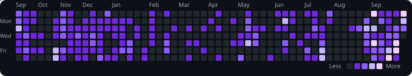

Hi, I'm

<h1 align="center">Amruth Shyju</h1>
<h3 align="center">Full Stack Engineer </h3>

<code>JavaScript · Node.js · TypeScript · Express · React · MongoDB · Redis</code>

Backend-focused engineering for software that has to keep working.

 

## Activity

Consistency · Building · Learning · Shipping

  

 

## About

I build production-oriented web systems with a strong focus on backend architecture, scalability, and real-world problem solving. Most of that work is TypeScript on Node.js: REST APIs, MongoDB, Redis, background jobs, and real-time updates, with React and Next.js when the product needs an interface.

The problems I keep coming back to are live GPS pipelines, tenant-isolated SaaS, role-based access, and background jobs that retry instead of dropping work.

**I enjoy turning complex requirements into clean, scalable, maintainable systems.**

 

## Contribution Snake

  <picture>
    <source media="(prefers-color-scheme: dark)" srcset="https://raw.githubusercontent.com/AmruthAmruth/AmruthAmruth/output/github-contribution-grid-snake-dark.svg" />
    <source media="(prefers-color-scheme: light)" srcset="https://raw.githubusercontent.com/AmruthAmruth/AmruthAmruth/output/github-contribution-grid-snake.svg" />
    
  </picture>

 

## Stats

  
  

 

## How I Build

| Concern | In practice |
| --- | --- |
| Architecture | Clean, modular boundaries |
| Backend | Scalable APIs and services |
| Data | MongoDB and Redis |
| Async | BullMQ and background jobs |
| Realtime | Socket.IO |
| Security | JWT, RBAC, and Zod |
| Infrastructure | Docker, AWS, Nginx, and GitHub Actions |
| Frontend | React, Next.js, and Redux |

 

## Tech Stack

<h3 align="center">Backend</h3>

  

Node.js · TypeScript · Express.js

<h3 align="center">Databases and caching</h3>

  

MongoDB · Mongoose · Redis

<h3 align="center">Architecture</h3>

REST APIs · Clean Architecture · DDD · Repository pattern · Dependency injection · Multi-tenant architecture · RBAC · JWT · Zod

<h3 align="center">Async and realtime</h3>

  

BullMQ · Socket.IO

<h3 align="center">Frontend</h3>

  

React · Next.js · Redux · Tailwind CSS

<h3 align="center">DevOps and cloud</h3>

  

Docker · Nginx · AWS · Linux · GitHub Actions · Git · GitHub

 

## What I Build

- Scalable REST APIs
- Multi-tenant SaaS platforms
- Real-time applications
- GPS and trip-analytics systems
- Background jobs and queues
- Authentication and role-based access
- Production full-stack applications

 

## Let's Connect

Building something interesting, or want to talk through a system?

Architecture, real-time systems, and full stack engineering.

  
  &nbsp;&nbsp;
  
  &nbsp;&nbsp;
  

<a href="mailto:amruthshyju@gmail.com">amruthshyju@gmail.com</a>

